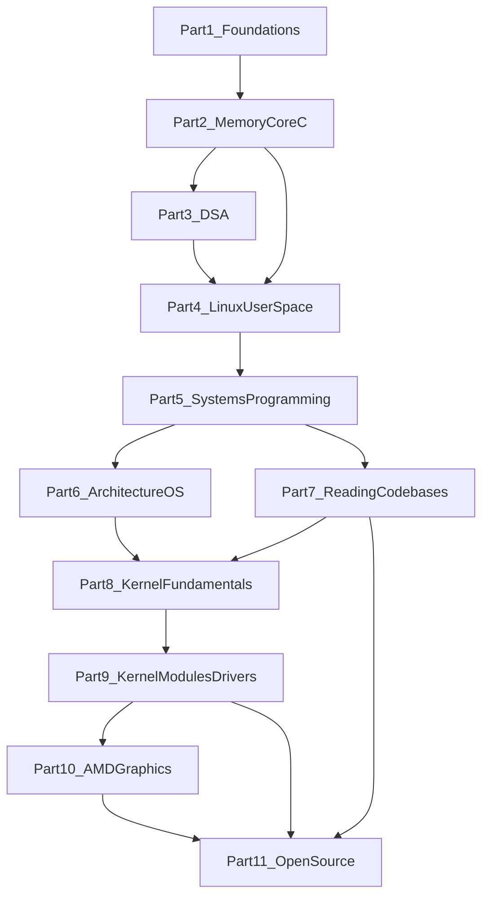

# Dependency Graph

This document shows how curriculum parts depend on one another and defines hard gates that must be passed before advancing.

## Part Dependency Graph



## Within-Part Module Chains

Each module within a part depends on the previous module in that part unless noted otherwise.

### Part 1: Programming Foundations

```
1.1 First C Program → 1.2 Control Flow → 1.3 Functions → 1.4 Arrays/Structs → 1.5 Debugging/Git
```

### Part 2: Memory and Core C

```
2.1 Pointers → 2.2 Dynamic Memory → 2.3 Stack/Heap → 2.4 Function Pointers → 2.5 GDB/Pitfalls
```

### Part 3: Data Structures and Algorithms

```
3.1 Lists/Stacks/Queues → 3.2 Hash Tables → 3.3 Trees → 3.4 Algorithmic Thinking → 3.5 Performance
```

### Part 4: Linux User-Space Development

```
4.1 Filesystem/I/O → 4.2 Processes/Signals → 4.3 Threads → 4.4 IPC → 4.5 Make/Build → 4.6 Libraries
```

### Part 5: Linux Systems Programming

```
5.1 Syscalls → 5.2 fork/exec → 5.3 Pipes → 5.4 pthreads → 5.5 TCP/IP → 5.6 Event-Driven
```

### Part 6: Computer Architecture and OS

```
6.1 CPU Architecture → 6.2 Virtual Memory → 6.3 Scheduling → 6.4 Filesystems → 6.5 Drivers/Interrupts/Caches
```

### Part 7: Reading Large Codebases

```
7.1 Navigating Repos → 7.2 Linux Source Tree → 7.3 Docs and Small Fixes
```

### Part 8: Linux Kernel Fundamentals

```
8.1 Kernel Architecture → 8.2 Kernel Build → 8.3 Subsystems/APIs → 8.4 MM/Scheduling → 8.5 Synchronization
```

### Part 9: Kernel Modules and Drivers

```
9.1 LKM → 9.2 Char Devices → 9.3 Sysfs/Procfs → 9.4 PCI/Driver Model → 9.5 HW Interfaces
```

### Part 10: AMD Driver and Graphics Stack

```
10.1 Graphics Stack → 10.2 DRM/AMDGPU → 10.3 Mesa/Scheduling → 10.4 GEM/TTM
```

### Part 11: Open Source Contributions

```
11.1 Patch Workflow/Reviews → 11.2 Linux Contribution Process → 11.3 Upstream/Capstone
```

Completing Part 11 satisfies the **curriculum completion gate** (all 52 projects).

## Hard Gates

These rules prevent skipping foundational material. Do not advance until exit criteria are met.

| Gate | Requirement |
|------|-------------|
| Start Part 2 | Complete Part 1 exit gate (includes gradebook capstone) |
| Start Part 4 | Complete Part 2 exit gate (pointers, malloc, GDB comfort) |
| Start Part 5 | Complete Part 4 exit gate (file I/O, processes, makefiles) |
| Start Part 8 | Complete Parts 5, 6, and 7 |
| Start Part 10 | Complete Parts 8 and 9 |
| Start Part 11 | Complete Parts 7, 9, and 10 (or equivalent experience) |
| Curriculum complete | Complete Part 11 exit gate (Project 52 Part B + module reports) |

### Parallel Paths

- **Part 3 and Part 4:** Part 4 requires Part 2; Part 3 also requires Part 2. You may do Part 3 before or in parallel with early Part 4 modules, but both should be complete before Part 5.
- **Part 6 and Part 7:** Both require Part 5. Part 6 can run in parallel with late Part 5 modules. Part 7 can start after Part 5. Both must be complete before Part 8.

## Why Kernel Development Is Gated

Kernel code assumes fluency in:

- C memory management (Part 2)
- Linux system calls and process model (Parts 4–5)
- Computer architecture and virtual memory (Part 6)
- Reading unfamiliar codebases (Part 7)

Attempting kernel modules before these foundations leads to dangerous mistakes and frustration. The curriculum intentionally delays kernel content until Part 8.

## Visual: Full Learning Path

```
User Space                          Kernel Space
──────────                          ────────────
Part 1: C basics
Part 2: Memory/pointers
Part 3: Data structures ──┐
Part 4: Linux user-space  ├── Part 5: Systems programming
                           │
Part 6: Architecture ─────┤
Part 7: Reading code ─────┤
                           ▼
                    Part 8: Kernel fundamentals
                    Part 9: Kernel modules/drivers
                    Part 10: AMD/graphics stack
                    Part 11: Open source contributions
```
