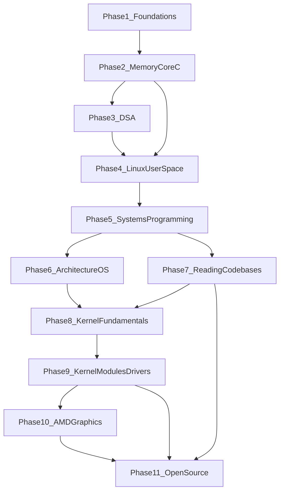

# Dependency Graph

This document shows how curriculum phases depend on one another and defines hard gates that must be passed before advancing.

## Phase Dependency Graph



## Within-Phase Module Chains

Each module within a phase depends on the previous module in that phase unless noted otherwise.

### Phase 1: Programming Foundations

```
1.1 First C Program → 1.2 Control Flow → 1.3 Functions → 1.4 Arrays/Structs → 1.5 Debugging/Git
```

### Phase 2: Memory and Core C

```
2.1 Pointers → 2.2 Dynamic Memory → 2.3 Stack/Heap → 2.4 Function Pointers → 2.5 GDB/Pitfalls
```

### Phase 3: Data Structures and Algorithms

```
3.1 Lists/Stacks/Queues → 3.2 Hash Tables → 3.3 Trees → 3.4 Algorithmic Thinking → 3.5 Performance
```

### Phase 4: Linux User-Space Development

```
4.1 Filesystem/I/O → 4.2 Processes/Signals → 4.3 Threads → 4.4 IPC → 4.5 Make/Build → 4.6 Libraries
```

### Phase 5: Linux Systems Programming

```
5.1 Syscalls → 5.2 fork/exec → 5.3 Pipes → 5.4 pthreads → 5.5 TCP/IP → 5.6 Event-Driven
```

Phases 6–11 module chains will be documented when those phases are expanded.

## Hard Gates

These rules prevent skipping foundational material. Do not advance until exit criteria are met.

| Gate | Requirement |
|------|-------------|
| Start Phase 2 | Complete Phase 1 exit gate (includes gradebook capstone) |
| Start Phase 4 | Complete Phase 2 exit gate (pointers, malloc, GDB comfort) |
| Start Phase 5 | Complete Phase 4 exit gate (file I/O, processes, makefiles) |
| Start Phase 8 | Complete Phases 5, 6, and 7 |
| Start Phase 10 | Complete Phases 8 and 9 |
| Start Phase 11 | Complete Phases 7, 9, and 10 (or equivalent experience) |

### Parallel Paths

- **Phase 3 and Phase 4:** Phase 4 requires Phase 2; Phase 3 also requires Phase 2. You may do Phase 3 before or in parallel with early Phase 4 modules, but both should be complete before Phase 5.
- **Phase 6 and Phase 7:** Both require Phase 5. Phase 6 can run in parallel with late Phase 5 modules. Phase 7 can start after Phase 5. Both must be complete before Phase 8.

## Why Kernel Development Is Gated

Kernel code assumes fluency in:

- C memory management (Phase 2)
- Linux system calls and process model (Phases 4–5)
- Computer architecture and virtual memory (Phase 6)
- Reading unfamiliar codebases (Phase 7)

Attempting kernel modules before these foundations leads to dangerous mistakes and frustration. The curriculum intentionally delays kernel content until Phase 8.

## Visual: Full Learning Path

```
User Space                          Kernel Space
──────────                          ────────────
Phase 1: C basics
Phase 2: Memory/pointers
Phase 3: Data structures ──┐
Phase 4: Linux user-space  ├── Phase 5: Systems programming
                           │
Phase 6: Architecture ─────┤
Phase 7: Reading code ─────┤
                           ▼
                    Phase 8: Kernel fundamentals
                    Phase 9: Kernel modules/drivers
                    Phase 10: AMD/graphics stack
                    Phase 11: Open source contributions
```
